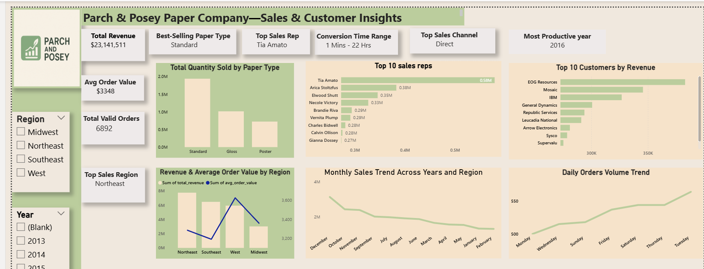
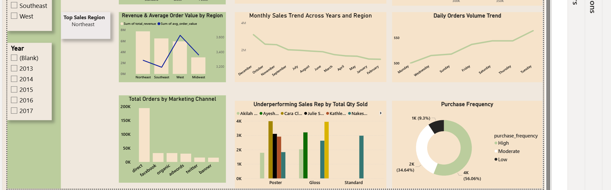

# 📊 parch-posey-paper-company-sql-powerbi-analysis
Business insights from Parch &amp; Posey data using SQL queries and Power BI

This project was developed during my time at **HerTechTrail Data Analytics Starter Track**.  
It combines **SQL for querying business data** and **Power BI for visualization** to uncover insights on sales, customer behavior, regional trends, and profitability.  

---

## 🔎 About This Project  
This project presents **data-driven insights into operations at Parch & Posey**, a paper company seeking to optimize sales, customer engagement, and marketing efficiency.  

As a **Junior Analyst (project role)**, I used **SQL queries** to extract and analyze sales, marketing, and customer behavior data. The analysis explored **key patterns across regions, sales reps, product types, and timeframes**, leading to actionable business recommendations.  

---

## 📌 Project Objectives  
- Explore **sales trends** over time and across regions.  
- Identify **top-performing customers, sales reps, and products**.  
- Evaluate **revenue drivers** and marketing effectiveness.  
- Use **Power BI dashboards** to visualize KPIs for decision-making.  

---

## 🧠 Methodology & Analytical Approach  

To ensure a structured and comprehensive analysis, I applied the following steps:  

- **Data Restructuring:** Unpivoted product quantity columns to enable comparison across paper types.  
- **Sales Aggregation:** Summarized revenues and order volumes across regions and timeframes.  
- **Customer Lifecycle Analysis:** Tracked the journey from first website visit to first purchase.  
- **Retention Segmentation:** Categorized purchase frequency to better understand customer retention and loyalty.

This approach ensured the insights were not just descriptive, but **strategically aligned with business decisions** in sales, marketing, and operations. 

## 1️⃣ Data Overview  

- **Dataset:** Parch & Posey company database  
- **Tables Used:**  
  - `accounts` – customer accounts  
  - `orders` – all purchase orders  
  - `sales_reps` – sales representatives  
  - `web_events` – customer marketing interactions  
  - `region` – regional segmentation of customers  
- **Timeframe:** 2013–2017  
   

## 📂 Project Structure  
- **SQL/** → Core business queries written in PostgreSQL.  
- **dashboards/** → Power BI visualizations (sales, regional performance, profitability).  
- **schema/** → Database schema of the Parch & Posey dataset.  
- **DOCUMENTATION.md** → Full detailed analysis, methodology, insights, and recommendations.

  ## 🖼 Visuals  

### 🗂 Database Schema  
  

### 📊 Dashboard Preview  
  

---

## 🛠 Tools & Skills  
- **SQL (PostgreSQL)** → Data querying and analysis.  
- **Power BI** → Data visualization and dashboard building.  
- **Data Analytics** → Business insights, recommendations, trend analysis.  

---

## 📊 Key Insights  
- 📦 **Product Demand:** Standard paper is the most purchased across all regions.  
- 💰 **Revenue Drivers:** Top 10 customers account for a significant share of revenue, concentrated in a few regions.  
- 🌍 **Regional Insights:** Certain regions consistently outperform others in both total revenue and average order value.  
- 👥 **Sales Reps:** Some sales reps underperform on low-demand paper types, suggesting potential for reassignment strategies.  
- 📈 **Trends:** Revenue and order values show steady growth from 2013–2017, with **2016 as the most productive year**.  
- 🎯 **Marketing Channels:** Organic and direct web events drive the most orders and revenue.  
- ⏳ **Customer Behavior:** On average, customers place their first order shortly after initial web interaction.  

---

## 📑 Documentation  
For detailed methodology, SQL breakdowns, and recommendations, check the full [Documentation](DOCUMENTATION.md).  
